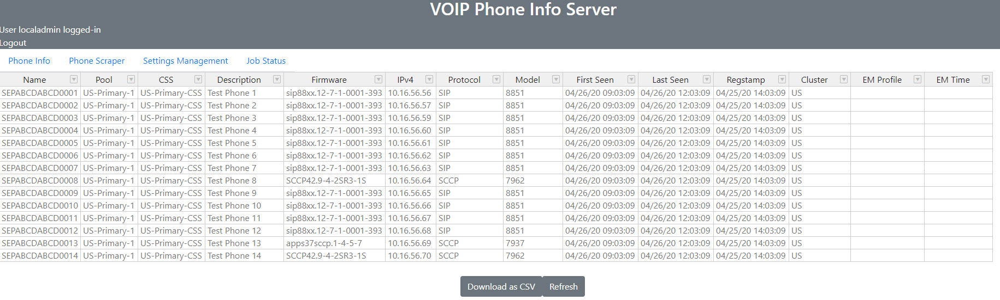
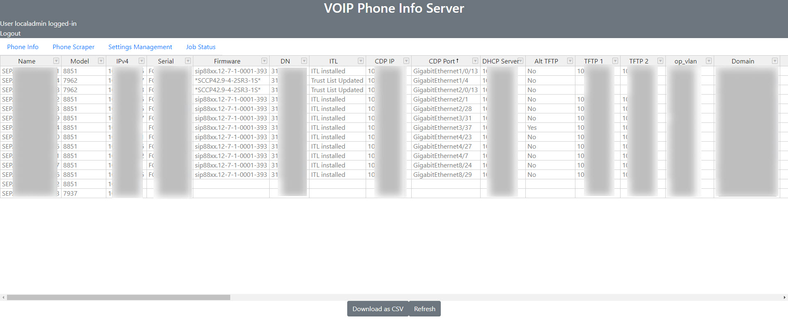
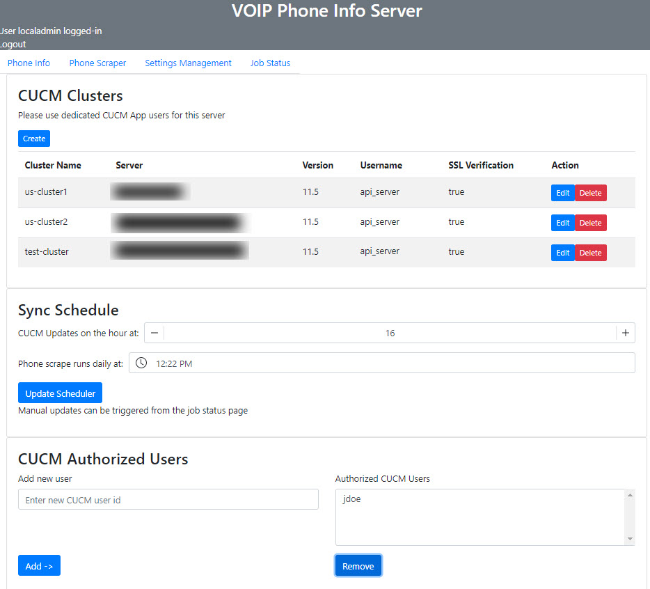
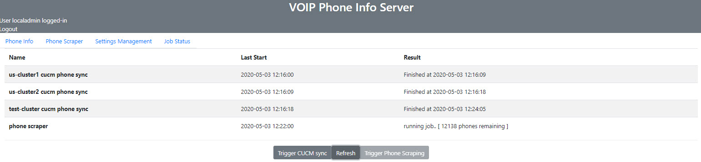

# Cisco VOIP Phone Info Web Application Server 
The VOIP Phone Info server is a application that collects IP phone data from your Cisco VOIP environment.

The key features are:

* **Phone configuration data**: Pulls high level configuration data (MAC/Description/Device Pool/etc) from Cisco Unified Communications Manager (CUCM) via AXL
* **Phone registration data**: Pulls real-time registration data (IP address, firmware, registration time stamp, EM logins) from CUCM via Serviceability API
* **IP Phone webpage**: Collects data (Serial number, CDP/LLDP neighbor info, ITL, Network info) by scraping the IP phone's internal web server
* **Multiple cluster support**: supports integration with multiple CUCM clusters
* **Docker**: Runs easily in Docker containers

## Screenshots

### Phone Info Page

### Phone Scraper Page

### Settings Page

### Job Status Page


## Requirements

Python 3.7+
 and/or
Docker

## CUCM Prerequisites
* Create a new application user on your CUCM with the following roles:
  * Standard AXL API Access
  * Standard CCM Admin Users
  * Standard CCMAdmin Read Only
  * Standard SERVICEABILITY Read Only

## Docker Installation

* Install docker
* clone/download CUCM Phone Info from github
* Edit the Docker environment variables file **docker-fastapi-variables.env** in the project root folder. Create your own secret key and specify your timezone
* run command below from terminal/command line

<div class="termy">

```console
docker-compose up
```

</div>

## First time setup info

* This will start a HTTPS web server on port 8080
* Login to https://localhost:8080/ with username 'localadmin' and password 'setup'
* Configure your CUCM clusters on the server.  The first CUCM server in the cluster will be used to authenticate future logins to the VOIP Phone Info server.
* Perform manual sync on the Job Status tab
* Set the scheduler to define the automatic update schedule
* All persistent data is stored in the 'data' bind mount.  A default self signed certificate is created the first time this application is run. You can replace the files in the 'data/cert' folder with CA signed certificates and then restart the containers.

## Known issues & limitations
* phone scraper script isn't perfect - some models are not fully working (7940/7960, 7937, Codecs)
* ITL status is populated based on the IP Phone webpage's 'status messages' page.  In some circumstances the phone will not have any recently reports of ITL status and therefore the ITL status is not reported.
* testing, has only been tested against CUCM 11.5
* schema files need to be updated with 12.5
* no redundancy for CUCM, if the CUCM node in the first cluster is down, logins will fail.
* The CUCM service account credentials are stored using symmetric encryption.  You are responsible for limiting access to the 'data' bind mount directory.

## Third-party software credits

* This application was built using FastAPI for the backend and VueJS for the front end.  This is my first application using both technologies, i'm sure there is room for alot of improvement.
* Handsontable Non-Commercial License - this application is using the Handsontable non-commercial license.  This application is for personal use.  Please see (https://github.com/handsontable/handsontable/blob/develop/handsontable-non-commercial-license.pdf) for more information.
* Phonescrape library originally from https://github.com/levensailor/phonescrape.  Some modifications to parse additional data, support various models, and store results in object

